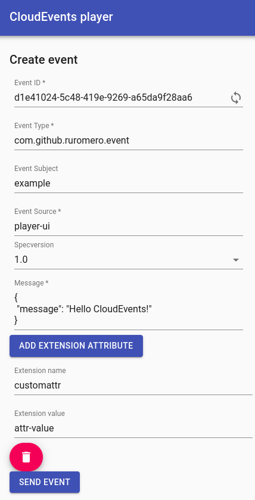
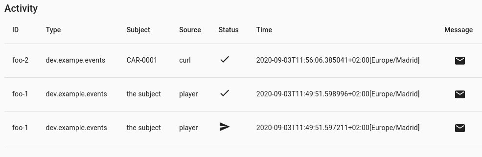
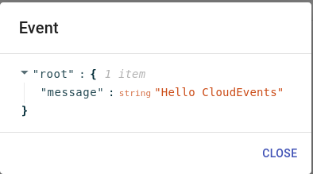

# CloudEvents Player

It is an application that can send and receive CloudEvents v1. Its purpose is to be deployed on a
KNative Eventing environment so that users can monitor received events in the Activity section and
also send events of the desired type to see if it is being forwarded back to the application through
the broker.

The application has a web interface in which you can define the events you want to send to the broker:



In the right-hand side all the emitted and received events will be listed. In the image below there are two received 
and one emitted event.



And you will also be able to display the payload of the event.



## Build and run the application

The application can be configured to send events to itself to ensure that both send/receive
work well and send valid CloudEvents.

By default the application will start using a loopback endpoint

```{bash}
./target/cloudevent-player-1.0-SNAPSHOT-runner
```

You can send a message from inside the application by filling in the form and the activity will show the sent
event and the received event (from the loopback)

You can also simulate the broker with the `curl`:

```shell script
$ curl -v http://localhost:8080 \
  -H "Content-Type: application/json" \
  -H "Ce-Id: foo-1" \
  -H "Ce-Specversion: 1.0" \
  -H "Ce-Type: dev.example.events" \
  -H "Ce-Source: curl-source" \
  -d '{"msg":"Hello team!"}'

> POST / HTTP/1.1
> User-Agent: curl/7.35.0
> Host: localhost:8080
> Accept: */*
> Ce-Id: foo-1
> Ce-Specversion: 1.0
> Ce-Type: dev.example.events
> Ce-Source: curl-source
> Content-Type: application/json
> Content-Length: 21
>
< HTTP/1.1 202 Accepted
< Content-Length: 0
< Date: Thu, 24 Oct 2019 08:27:06 GMT
```

It is a Quarkus application with a React frontend. In order to build the application use any of the
following alternatives:

### JVM Build

Build

```shell script
mvn clean package
```

Run

```shell script
$ java -jar target/quarkus-app/quarkus-run.jar
...
021-04-05 15:11:00,138 INFO  [io.quarkus] (main) cloudevent-player 1.0-SNAPSHOT on JVM (powered by Quarkus 1.13.0.Final) started in 1.246s. Listening on: http://0.0.0.0:8080
2021-04-05 15:11:00,138 INFO  [io.quarkus] (main) Profile prod activated. 
2021-04-05 15:11:00,138 INFO  [io.quarkus] (main) Installed features: [cdi, hibernate-validator, kubernetes-client, mutiny, rest-client, resteasy, resteasy-jsonb, servlet, smallrye-context-propagation, vertx, websockets] 
```

### Quarkus dev mode

```shell script
$ mvn clean compile quarkus:dev
...
Listening for transport dt_socket at address: 5005
...
[INFO] --- quarkus-maven-plugin:1.0.1.Final:dev (default-cli) @ cloudevent-player ---
Listening for transport dt_socket at address: 5005
2019-12-02 17:14:33,177 INFO  [io.und.web.jsr] (main) UT026003: Adding annotated server endpoint class com.redhat.syseng.tools.cloudevents.resources.MessagesSocket for path /socket
2019-12-02 17:14:33,556 INFO  [io.quarkus] (main) Quarkus 1.13.0.Final started in 2.161s. Listening on: http://0.0.0.0:8080
2019-12-02 17:14:33,556 INFO  [io.quarkus] (main) Profile dev activated. Live Coding activated.
2019-12-02 17:14:33,556 INFO  [io.quarkus] (main) Installed features: [cdi, hibernate-validator, kubernetes-client, mutiny, rest-client, resteasy, resteasy-jsonb, servlet, smallrye-context-propagation, vertx, websockets]
```

### Native build

Build

```shell script
mvn clean install -Pnative -Dquarkus.native.container-build=true
```

Run

```shell script
$ ./target/cloudevent-player-1.0-SNAPSHOT-runner
...
2021-04-05 15:07:09,940 INFO  [io.quarkus] (main) cloudevent-player 1.0-SNAPSHOT native (powered by Quarkus 1.13.0.Final) started in 0.016s. Listening on: http://0.0.0.0:8080
2021-04-05 15:07:09,940 INFO  [io.quarkus] (main) Profile prod activated. 
2021-04-05 15:07:09,940 INFO  [io.quarkus] (main) Installed features: [cdi, hibernate-validator, kubernetes-client, mutiny, rest-client, resteasy, resteasy-jsonb, servlet, smallrye-context-propagation, vertx, websockets]
2021-04-05 15:07:12,937 INFO  [com.red.sys.too.clo.ser.MessageService] (ForkJoinPool.commonPool-worker-3) Player mode LOCAL - broker: http://localhost:8080/
```

### Skip frontend build

The `skipFrontend` profile will not run npm commands. Useful when you are just changing Java code.

```{bash}
mvn clean package -PskipFrontend
```

## Build the container image

### JVM version

```shell script
podman build -t ruromero/cloudevents-player-jdk8:latest -f src/main/docker/Dockerfile.jvm .
```

### Native version

```shell script
podman build -t ruromero/cloudevents-player:latest -f src/main/docker/Dockerfile.native .
```

## Running CloudEvents Player on Kubernetes

### Requirements

* Knative serving
* Knative eventing

### Deploy the application

Use [deploy.yaml](./src/main/knative/deploy.yaml) to create the resources

```shell script
$ kubectl apply -n myproject -f src/main/knative/deploy.yaml
service.serving.knative.dev/cloudevents-player created
trigger.eventing.knative.dev/cloudevents-player created
```

The following resources are created:

* KNative Service: Pointing to the image and mounting the volume from the configMap
* Trigger: To subscribe to any message in the broker

## Configuration

Cloudevents player comes with 2 modes defined in the PLAYER_MODE environment variable:

 * LOCAL: Received events are forwarded to the loopback broker. This mode is just for development and testing
 * KNATIVE: The application will get the current namespace it is running in and will use the `PLAYER_BROKER` 
 environment variable to decide which broker to connect to (`default` is the default broker).
 